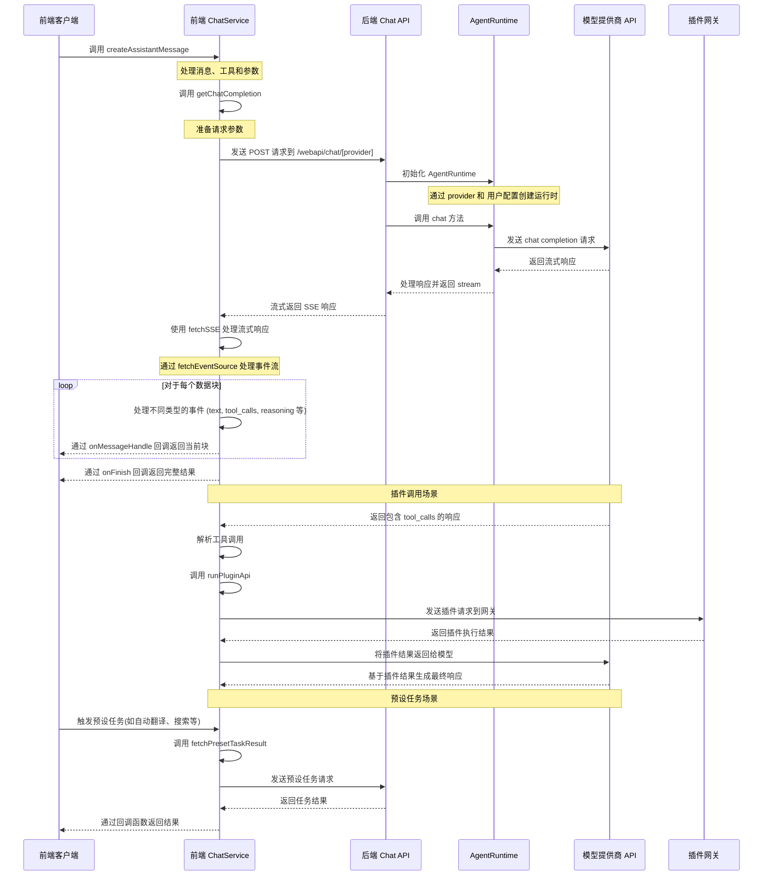

# Lobe Chat API 前后端交互逻辑

本文档说明了 Lobe Chat API 在前后端交互中的实现逻辑，包括事件序列和涉及的核心组件。

## 交互时序图



## 主要步骤说明

### 1. 客户端发起请求

用户发送消息后，`sendMessage()` （`src/store/chat/slices/aiChat/actions/conversationLifecycle.ts`）创建用户消息和助手消息占位，然后调用 `executeClientAgent()`。

### 2. Agent Runtime 驱动循环

Agent Runtime 是整个 chat 流程的**核心执行引擎**。每次聊天交互（从简单问答到复杂多步工具调用）都通过 `AgentRuntime.step()` 循环驱动。

**初始化** （`src/store/chat/slices/aiChat/actions/streamingExecutor.ts`）：

1. 解析 agent 配置（模型、provider、插件列表等）
2. 通过 `createAgentToolsEngine()` 创建工具注册表
3. 创建 `GeneralChatAgent`（"大脑"，决定下一步做什么）和 `AgentRuntime`（"引擎"，执行指令）
4. 通过 `createAgentExecutors()` 注入自定义执行器

**执行循环**：

```ts
while (state.status !== 'done' && state.status !== 'error') {
  result = await runtime.step(state, nextContext);
  // GeneralChatAgent 决定: call_llm → call_tool → call_llm → finish
}
```

每一步中，`GeneralChatAgent` 根据当前状态返回一条 `AgentInstruction`，`AgentRuntime` 通过对应的 executor 执行：

- `call_llm`：调用 LLM（见下方步骤 3-5）
- `call_tool`：执行工具调用（见下方步骤 6）
- `finish`：结束循环
- `compress_context`：上下文压缩
- `request_human_approve` / `request_human_prompt` / `request_human_select`：请求用户介入

### 3. 前端处理 LLM 请求

当 Agent 发出 `call_llm` 指令时，executor 调用 ChatService：

- `src/services/chat/index.ts` 对消息、工具和参数进行预处理
- `src/services/chat/mecha/` 下的模块完成上下文工程（context engineering），包括 agent 配置解析、模型参数解析、MCP 上下文注入等
- 调用 `getChatCompletion` 准备请求参数
- 使用 `@lobechat/fetch-sse` 包中的 `fetchSSE` 发送请求到后端 API

### 4. 后端处理请求

- `src/app/(backend)/webapi/chat/[provider]/route.ts` 接收请求
- 调用 `initModelRuntimeFromDB` 从数据库读取用户的 provider 配置，初始化 ModelRuntime
- 同时存在 tRPC 路由 `src/server/routers/lambda/aiChat.ts`，用于服务端消息发送和结构化输出等场景

### 5. 模型调用与响应处理

- `ModelRuntime` （`packages/model-runtime/src/core/ModelRuntime.ts`）调用相应模型提供商的 API，返回流式响应
- 前端通过 `fetchSSE` 和 [fetchEventSource](https://github.com/Azure/fetch-event-source) 处理流式响应
- 对不同类型的事件（文本、工具调用、推理等）进行处理
- 通过回调函数将结果传递回客户端

### 6. 工具调用场景

当 AI 模型在响应中返回 `tool_calls` 字段时，Agent 会发出 `call_tool` 指令。LobeHub 支持三种工具类型：

**Builtin 工具**：内置在应用中的工具，通过本地执行器直接运行。

- 前端通过 `invokeBuiltinTool` 方法在客户端直接执行
- 包括搜索、DALL-E 图像生成等内置功能

**MCP 工具**：通过 [Model Context Protocol](https://modelcontextprotocol.io/) 连接的外部工具。

- 前端通过 `invokeMCPTypePlugin` 方法调用 `MCPService`（`src/services/mcp.ts`）
- 支持 stdio、HTTP（streamable-http/SSE）和云端（Composio）三种连接方式
- MCP 工具的注册和发现通过 MCP 服务器配置管理

**Plugin 工具**：传统插件体系，通过 API 网关调用。该体系预期将逐步废弃，由 MCP 工具体系替代。

- 前端通过 `invokeBuiltinTool` 方法调用
- 获取插件设置和清单、创建认证请求头、发送请求到插件网关

工具执行完成后，结果写入消息并返回给 Agent 循环，Agent 会再次调用 LLM 基于工具结果生成最终响应。工具分发逻辑位于 `src/store/chat/slices/plugin/actions/pluginTypes.ts`。

### 7. 预设任务处理

预设任务是系统预定义的特定功能任务，通常在用户执行特定操作时触发（不经过 Agent Runtime 循环，直接调用 LLM）。这些任务使用 `fetchPresetTaskResult` 方法执行，该方法与正常聊天流程类似，但会使用专门设计的提示词（prompt chain）。

**执行时机**：预设任务主要在以下场景被触发：

1. **角色信息自动生成**：当用户创建或编辑角色时触发
   - 角色头像生成（通过 `autoPickEmoji` 方法）
   - 角色描述生成（通过 `autocompleteAgentDescription` 方法）
   - 角色标签生成（通过 `autocompleteAgentTags` 方法）
   - 角色标题生成（通过 `autocompleteAgentTitle` 方法）

2. **消息翻译**：用户手动点击翻译按钮时触发（通过 `translateMessage` 方法）

3. **网页搜索**：当启用搜索但模型不支持工具调用时，通过 `fetchPresetTaskResult` 实现搜索功能

**实际代码示例**：

角色头像自动生成实现：

```ts
// src/features/AgentSetting/store/action.ts
autoPickEmoji: async () => {
  const { config, meta, dispatchMeta } = get();
  const systemRole = config.systemRole;

  chatService.fetchPresetTaskResult({
    onFinish: async (emoji) => {
      dispatchMeta({ type: 'update', value: { avatar: emoji } });
    },
    onLoadingChange: (loading) => {
      get().updateLoadingState('avatar', loading);
    },
    params: merge(
      get().internal_getSystemAgentForMeta(),
      chainPickEmoji([meta.title, meta.description, systemRole].filter(Boolean).join(',')),
    ),
    trace: get().getCurrentTracePayload({ traceName: TraceNameMap.EmojiPicker }),
  });
};
```

翻译功能实现：

```ts
// src/store/chat/slices/translate/action.ts
translateMessage: async (id, targetLang) => {
  // ...省略部分代码...

  // 检测语言
  chatService.fetchPresetTaskResult({
    onFinish: async (data) => {
      if (data && supportLocales.includes(data)) from = data;
      await updateMessageTranslate(id, { content, from, to: targetLang });
    },
    params: merge(translationSetting, chainLangDetect(message.content)),
    trace: get().getCurrentTracePayload({ traceName: TraceNameMap.LanguageDetect }),
  });

  // 执行翻译
  chatService.fetchPresetTaskResult({
    onMessageHandle: (chunk) => {
      if (chunk.type === 'text') {
        content = chunk.text;
        internal_dispatchMessage({
          id,
          type: 'updateMessageTranslate',
          value: { content, from, to: targetLang },
        });
      }
    },
    onFinish: async () => {
      await updateMessageTranslate(id, { content, from, to: targetLang });
      internal_toggleChatLoading(false, id, n('translateMessage(end)', { id }) as string);
    },
    params: merge(translationSetting, chainTranslate(message.content, targetLang)),
    trace: get().getCurrentTracePayload({ traceName: TraceNameMap.Translation }),
  });
};
```

### 8. 完成

当 Agent 发出 `finish` 指令时，循环结束，调用 `onFinish` 回调，提供完整的响应结果。

## 客户端 vs 服务端执行

Agent Runtime 循环的执行位置取决于场景：

- **客户端循环**（浏览器）：常规 1:1 对话、继续生成、群组编排决策。循环在浏览器中运行，入口为 `executeClientAgent()` （`src/store/chat/slices/aiChat/actions/streamingExecutor.ts`）
- **服务端循环**（队列 / 本地）：群聊 supervisor agent、子 agent 任务、API/Cron 触发。循环在服务端运行，通过 SSE 流式推送事件到客户端，入口为 `AgentRuntimeService.executeStep()` （`src/server/services/agentRuntime/AgentRuntimeService.ts`），tRPC 路由为 `src/server/routers/lambda/aiAgent.ts`

## Model Runtime

Model Runtime（`packages/model-runtime/`）是 LobeHub 中与 LLM 模型提供商交互的核心抽象层，负责将不同提供商的 API 适配为统一接口。

**核心职责**：

- **统一抽象层**：通过 `LobeRuntimeAI` 接口（`packages/model-runtime/src/core/BaseAI.ts`）隐藏不同 AI 提供商 API 的差异
- **模型初始化**：通过 provider 映射表（`packages/model-runtime/src/runtimeMap.ts`）初始化对应的运行时实例
- **能力封装**：`chat`（聊天流式请求）、 `models`（模型列表）、`embeddings`（文本嵌入）、 `createImage`（图像生成）、`textToSpeech`（语音合成）、 `generateObject`（结构化输出）

**核心接口**：

```ts
export interface LobeRuntimeAI {
  baseURL?: string;
  chat(payload: ChatStreamPayload, options?: ChatCompetitionOptions): Promise<Response>;
  embeddings?(payload: EmbeddingsPayload, options?: EmbeddingsOptions): Promise<Embeddings[]>;
  models?(): Promise<any>;
  textToSpeech?: (
    payload: TextToSpeechPayload,
    options?: TextToSpeechOptions,
  ) => Promise<ArrayBuffer>;
}
```

**适配器实现示例**：

1. **OpenRouter 适配器**：OpenRouter 是一个统一 API，可以通过它访问多个模型提供商的 AI 模型。Lobe Chat 通过适配器实现对 OpenRouter 的支持：

   ```ts
   // OpenRouter 适配器实现
   class LobeOpenRouterAI implements LobeRuntimeAI {
     client: OpenAI;
     baseURL: string;

     constructor(options: OpenAICompatibleOptions) {
       // 初始化 OpenRouter 客户端，使用 OpenAI 兼容的 API
       this.client = new OpenAI({
         apiKey: options.apiKey,
         baseURL: OPENROUTER_BASE_URL,
         defaultHeaders: {
           'HTTP-Referer': 'https://github.com/lobehub/lobe-chat',
           'X-Title': 'LobeHub',
         },
       });
       this.baseURL = OPENROUTER_BASE_URL;
     }

     // 实现聊天功能
     async chat(payload: ChatCompletionCreateParamsBase, options?: RequestOptions) {
       // 将 Lobe Chat 的请求格式转换为 OpenRouter 格式
       // 处理模型映射、消息格式等
       return this.client.chat.completions.create(
         {
           ...payload,
           model: payload.model || 'openai/gpt-4-turbo', // 默认模型
         },
         options,
       );
     }

     // 实现其他 LobeRuntimeAI 接口方法
   }
   ```

2. **Google Gemini 适配器**：Gemini 是 Google 的大语言模型，Lobe Chat 通过专门的适配器支持 Gemini 系列模型：

   ```ts
   import { GoogleGenerativeAI } from '@google/generative-ai';

   // Gemini 适配器实现
   class LobeGoogleAI implements LobeRuntimeAI {
     client: GoogleGenerativeAI;
     baseURL: string;
     apiKey: string;

     constructor(options: GoogleAIOptions) {
       // 初始化 Google Generative AI 客户端
       this.client = new GoogleGenerativeAI(options.apiKey);
       this.apiKey = options.apiKey;
       this.baseURL = options.baseURL || GOOGLE_AI_BASE_URL;
     }

     // 实现聊天功能
     async chat(payload: ChatCompletionCreateParamsBase, options?: RequestOptions) {
       // 选择合适的模型（支持 Gemini Pro、Gemini Flash 等）
       const modelName = payload.model || 'gemini-pro';
       const model = this.client.getGenerativeModel({ model: modelName });

       // 处理多模态输入（如图像）
       const contents = this.processMessages(payload.messages);

       // 设置生成参数
       const generationConfig = {
         temperature: payload.temperature,
         topK: payload.top_k,
         topP: payload.top_p,
         maxOutputTokens: payload.max_tokens,
       };

       // 创建聊天会话并获取响应
       const chat = model.startChat({
         generationConfig,
         history: contents.slice(0, -1),
         safetySettings: this.getSafetySettings(payload),
       });

       // 处理流式响应
       return this.handleStreamResponse(chat, contents, options?.signal);
     }

     // 实现其他处理方法
     private processMessages(messages) {
       /* ... */
     }
     private getSafetySettings(payload) {
       /* ... */
     }
     private handleStreamResponse(chat, contents, signal) {
       /* ... */
     }
   }
   ```

**不同模型的适配实现**：

- `src/libs/agent-runtime/openai/index.ts` - OpenAI 实现
- `src/libs/agent-runtime/anthropic/index.ts` - Anthropic 实现
- `src/libs/agent-runtime/google/index.ts` - Google 实现
- `src/libs/agent-runtime/openrouter/index.ts` - OpenRouter 实现

详细实现可以查看：

- `src/libs/agent-runtime/AgentRuntime.ts` - 核心运行时类
- `src/libs/agent-runtime/BaseAI.ts` - 定义基础接口
- `src/libs/agent-runtime/runtimeMap.ts` - 提供商映射表
- `src/libs/agent-runtime/UniformRuntime/index.ts` - 处理多模型统一运行时
- `src/libs/agent-runtime/utils/openaiCompatibleFactory/index.ts` - OpenAI 兼容适配器工厂
